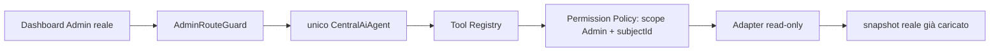

# Phase 3 — AI Dashboard Admin read-only

## Esito dell'audit preliminare

La Dashboard reale è `src/pages/admin/AdminDashboard.jsx`, montata dietro `AdminRouteGuard`. La guard ricava l'utente da `supabase.auth.getUser()` e il ruolo da `profiles.role`; ammette soltanto `admin` e `super_admin` e fallisce chiusa. L'integrazione riceve questa identità dal context della guard e non legge ruolo o identificativi da URL, messaggi o stato UI.

La Dashboard carica dati tramite `getRealCampaigns()` e `selectOptionalTable()`:

- campagne normalizzate da `campaigns`, `campagne` e `quote_requests`;
- riepiloghi operativi derivati da `delivery_sessions`, `gps_tracking_points` e `proof_photos`;
- disponibilità di `smart_pairing_waitlist` e `activity_log`.

Le migrazioni esistenti applicano policy Admin basate su `profiles.id = auth.uid()` e ruolo `admin`/`super_admin`. Non sono stati modificati schema, migrazioni, RLS o API.

### Dati collegati

- `Campaign Tool`: campagne reali attive, in ritardo, incomplete, preventivi aperti e record che richiedono attenzione.
- `Customer Tool`: nomi aziendali recenti derivati esclusivamente dalle campagne reali già caricate.
- `Dashboard Tool`: conteggi operativi, campi/fonti mancanti e definizioni dei KPI supportati.

### Dati esclusi

- record classificati `test`, `demo`, `placeholder`, `fake` o `sample`;
- fornitori: la Dashboard non dispone di una relazione reale fornitori-campagne;
- documenti, pagamenti e dati finanziari: non fanno parte dello snapshot di questa Dashboard;
- GPS analitico, Pricing, Notification e Analytics: non collegati in questa fase;
- waitlist e activity log: disponibili nella UI, ma non necessari alle domande approvate e quindi non esposti agli adapter.

## Architettura

`applicationAiFoundation.js` è il composition root condiviso: conserva una sola istanza di `CentralAiAgent` e instrada runtime e adapter per ruolo/scope. Cliente e Admin usano quindi lo stesso cervello, con provider dati e sessioni separati. Con `VITE_AI_ADMIN_DASHBOARD_ENABLED=false` il componente resta in un dynamic import non richiesto: il pannello non viene montato, l'integrazione Admin non viene caricata e non viene creato alcun relativo stato sessione.

## Minimizzazione e grounding

Gli adapter Admin non espongono email, telefono, indirizzi, dati fiscali, coordinate, token, `createdBy`, ID completi o payload raw. Espongono solo riferimento abbreviato, nome aziendale sanificato, stato, servizio, zona, quantità, date, fonte e conteggi operativi aggregati. Un'etichetta che assomiglia a email o telefono diventa `Cliente non nominato`.

Ogni risposta fattuale deve citare una chiamata tool riuscita e la relativa fonte. Senza tool riusciti il `CentralAiAgent` usa il fallback sicuro. Il runtime è deterministico e non contiene chiavi o chiamate OpenAI nel browser.

## Regole deterministiche

- **In ritardo:** campagna reale non completata con data fine precedente all'inizio del giorno corrente.
- **Record incompleto:** classificazione `incomplete` e motivo prodotto dal normalizzatore reale della Dashboard.
- **Problema operativo:** campagna reale con `ops.problems > 0`, conteggio già derivato da sessioni/punti operativi.
- **Richiede attenzione:** unione delle tre condizioni precedenti, senza scoring o livello di rischio inventato.
- **Preventivo aperto:** record non test proveniente da `quote_requests` e non completato.

La risposta mostra la regola applicata. Non produce anomalie GPS o documentali e non presenta suggerimenti come fatti.

## Domande supportate

- campagne attive, in ritardo, incomplete o da attenzionare;
- clienti con campagne recenti;
- preventivi aperti;
- riepilogo operativo;
- dati/fonti mancanti;
- spiegazione dei KPI supportati.

Richieste su fornitori, documenti, pagamenti, GPS/copertura e fonti non collegate ricevono una dichiarazione di indisponibilità. Qualunque richiesta di modifica, assegnazione, approvazione, invio, pagamento, creazione o eliminazione viene rifiutata senza chiamare tool.

## Sessione e autorizzazione

La Permission Policy genera lo scope Admin con `subjectId` dall'identità autenticata. Ogni adapter confronta tale ID con l'identità fornita dalla guard. Argomenti `adminId`, `subjectId`, `userId` o `role` non possono cambiare lo scope. Il cleanup rimuove provider, cronologia e chiavi `vp_ai_admin_session:*` al cambio identità/unmount, lasciando intatte le sessioni Cliente.

## File della Phase 3

Nuovi:

- `src/ai-foundation/integrations/admin-dashboard/adminDashboardAdapters.js`
- `src/ai-foundation/integrations/admin-dashboard/AdminDashboardReadOnlyRuntime.js`
- `src/ai-foundation/integrations/admin-dashboard/adminDashboardFoundation.js`
- `src/components/ai/admin/AdminCentralAiPanel.jsx`
- `src/components/ai/admin/admin-central-ai.css`
- test `ai_admin_*` e screenshot `e2e-artifacts-ai-admin-phase3/*`

Modifiche circoscritte:

- `AdminGuard.jsx`: espone l'identità già verificata tramite context;
- `AdminDashboard.jsx`: mount lazy e condizionale del pannello;
- `runtimeFlags.js` e `.env.example`: flag separata, disattivata per default;
- `AiPermissionPolicy.js`: lega anche lo scope Admin al subject autenticato;
- composition root/registry condivisi: multiplexing per scope e stato `unsupported_data` controllato.

L'integrazione Cliente conserva runtime, adapter, pannello, flag e comportamento Phase 2; utilizza soltanto il composition root unico condiviso.
