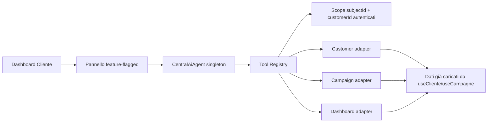

# Phase 2 — CentralAiAgent nella Dashboard Cliente

## Stato iniziale verificato

### Dashboard e autenticazione

- La Dashboard Cliente reale è `DashboardPage` in `volantinipro-final.jsx`.
- L'accesso avviene con magic link Supabase.
- La sessione REST è conservata in `vp_supabase_session` e collegata al client SDK da `ensureSupabaseSessionBridge`.
- `useCliente()` ottiene prima `supabase.auth.getUser()`, poi risolve `public.clienti` tramite l'email autenticata.
- L'ID cliente usato per lo scope AI è `cliente.id`; resta distinto da `auth.users.id`.

### Dati realmente disponibili

`useCampagne()` legge `public.campagne`, ordinata per `created_at`, e mantiene solo righe riconducibili al cliente tramite:

- `cliente_id` uguale a `cliente.id`;
- email della campagna uguale all'email autenticata;
- email presente nei metadata uguale all'email autenticata.

I campi riutilizzati dagli adapter, quando presenti, sono: stato, stato pagamento, servizio, quantità, zona/comune, comuni selezionati, date, totale reale, timestamp e `metadata.quote_summary`.

### RLS verificata nei file versionati

La baseline `000_baseline_reproducible_schema.sql` abilita RLS su `clienti` e `campagne` e contiene `clienti_select_own` e `campagne_select_own`, basate su `auth.uid()` o email JWT. Gli adapter applicano comunque un secondo controllo applicativo sullo scope.

`022_dms_archivio_setup.sql` rende `documenti` accessibile soltanto ad Admin. Per questo il Document Tool non è stato collegato. La Dashboard mostra inoltre GPS/foto e documenti come placeholder, non come query cliente reali.

### AI preesistente

La Dashboard include già riepiloghi, notifiche e domande guidate deterministiche costruite da `src/lib/ai`. Questi componenti non usavano la Foundation centrale e non sono stati rimossi o modificati.

## Flusso implementato



Non vengono effettuate nuove query applicative dagli adapter: essi proiettano in sola lettura i dati reali già ottenuti dalla Dashboard e protetti da RLS e filtro ownership.

## Adapter collegati

- Customer Tool: profilo minimo del cliente autenticato.
- Campaign Tool: stato, campagne recenti, ultimo preventivo disponibile, servizio, quantità, zona, date e indicatore report derivato dallo stato.
- Dashboard Tool: riepilogo conteggi e campi mancanti.

Non collegati: Document, GPS, Pricing, Territory, Notification, Supplier e Analytics. Non esiste una fonte cliente reale necessaria e autorizzata per queste domande in questa fase.

## Runtime

`CustomerDashboardReadOnlyRuntime` è un adapter deterministico del Runtime Port. Non usa OpenAI e non simula un modello generativo: seleziona esclusivamente operazioni supportate e compone testo dai risultati tool citati.

Nessuna chiave è presente nel frontend. `OPENAI_API_KEY` resta una variabile server-side; non esiste alcuna variabile `VITE_OPENAI_*`.

## Feature flag

```env
VITE_AI_CUSTOMER_DASHBOARD_ENABLED=false
```

Il default è `false`. Con flag disabilitata il pannello non viene renderizzato, il singleton non viene creato e nessuna chiamata AI viene eseguita.

## Domande supportate

- A che punto è la mia campagna?
- Mostrami le mie campagne recenti.
- Mostrami il mio ultimo preventivo.
- Quale servizio ho scelto?
- Qual è la quantità della campagna?
- In quale zona è prevista la distribuzione?
- Quando è programmato il lavoro?
- La campagna è completata?
- Sono disponibili report o foto?
- Spiegami questa dashboard.
- Quali informazioni risultano mancanti?

La disponibilità report è esplicitamente un indicatore derivato dallo stato campagna. Le foto restano non disponibili perché la fonte non è collegata.

## Funzioni non supportate

- scritture o modifiche a campagne/preventivi;
- invio email o notifiche;
- creazione documenti;
- dati GPS/foto reali;
- calcoli prezzi o territoriali;
- azioni Admin/Fornitore;
- domande su clienti diversi da quello autenticato;
- modello generativo OpenAI nel browser.

## Sicurezza

- `subjectId` e `customerId` sono distinti e devono entrambi coincidere con lo snapshot autenticato.
- Gli ID inseriti nel testo non diventano mai argomenti di scope.
- Argomenti `customerId`, `clienteId` o `ownerId` diversi dallo scope vengono negati.
- Ogni risposta fattuale richiede citazione e nome del tool riuscito.
- Timeout, output invalidi ed errori backend sono ridotti a codici sicuri.
- Logout rimuove cronologia, stato, snapshot dati e ID di sessione browser.
- Nessun adapter espone operazioni write.

## Screenshot

- `e2e-artifacts-ai-customer-phase2/customer-central-agent-desktop.png`
- `e2e-artifacts-ai-customer-phase2/customer-central-agent-mobile.png`
