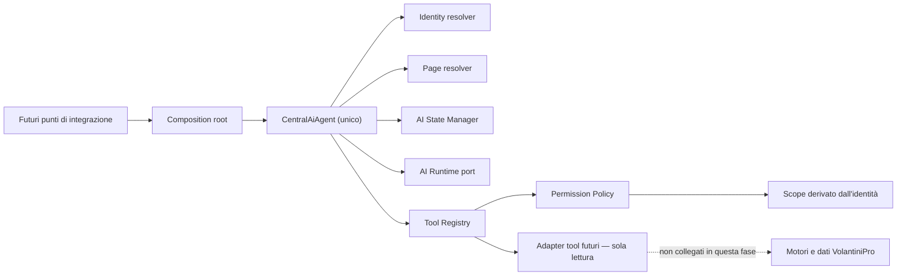

# AI Foundation — VolantiniPro

## Scopo

Questa Foundation introduce un solo Agent centrale, senza collegarlo a UI, routing, database, Supabase, API o motori esistenti. I moduli AI verticali potranno essere migrati gradualmente usando il composition root `createAiFoundation`.

## Componenti

## Flusso di inizializzazione

1. Il punto di integrazione futuro passa `sessionId`, utente autenticato/profilo, URL corrente e gli eventuali riferimenti a campagna o preventivo attivi.
2. `AiIdentityResolver` normalizza il ruolo. Identità assente o ruolo sconosciuto diventano `visitatore` (fail closed).
3. `AiPageResolver` classifica la pagina senza intervenire sul router.
4. `AiStateManager` crea o aggiorna la sessione. Un cambio di soggetto elimina cronologia, campagna e preventivo precedenti.
5. `CentralAiAgent` compone il prompt centrale con ruolo e pagina, quindi chiede al runtime un piano.
6. `AiToolRegistry` espone solo tool ammessi per il ruolo. La policy crea lo scope dal soggetto autenticato, mai dagli argomenti prodotti dal modello.
7. Gli adapter futuri restituiscono dati reali in sola lettura. Senza adapter, dati o citazioni valide, l'Agent restituisce una risposta sicura di indisponibilità.
8. Messaggio utente, risposta e riferimenti alle evidenze vengono salvati nella sessione.

## Moduli

- `contracts.js`: ruoli, pagine, scope, tool e porte JSDoc.
- `identity/AiIdentityResolver.js`: riconoscimento utente.
- `context/AiPageResolver.js`: riconoscimento pagina.
- `security/AiPermissionPolicy.js`: matrice dei permessi e scope server-derived.
- `state/AiStateManager.js`: utente, ruolo, pagina, campagna, preventivo, sessione e cronologia.
- `tools/toolManifest.js`: catalogo dei tool futuri.
- `tools/AiToolRegistry.js`: registrazione, autorizzazione ed esecuzione fail-closed.
- `prompt/centralSystemPrompt.js`: prompt ufficiale centrale.
- `agent/CentralAiAgent.js`: orchestratore unico.
- `createAiFoundation.js`: dependency injection/composition root.
- `index.js`: API pubblica della Foundation.

## Tool predisposti

Campaign, GPS, Territory, Customer, Supplier, Dashboard, Pricing, Notification, Document e Analytics. Sono definiti esclusivamente contratto, descrizione, modalità `read-only` e scope per ruolo; nessuna logica esistente è stata duplicata o modificata.

## Invarianti di sicurezza

- Visitatore: solo scope pubblico.
- Cliente: scope pubblico e `customerId` autenticato.
- Fornitore: scope pubblico e soli lavori assegnati al `supplierId` autenticato.
- Admin: scope completo.
- Lo scope non è preso dagli argomenti del modello.
- Nessun tool è operativo finché un adapter esplicito non viene registrato.
- Ogni risposta basata su tool deve citare almeno un risultato riuscito della richiesta corrente.
- L'Agent e i tool sono progettati in sola lettura.

## Integrazione graduale

Preventivo Guidato (Step 1–4), Dashboard Cliente, Dashboard Fornitore, Dashboard Admin, GPS, Report e Analytics possono collegarsi allo stesso composition root aggiungendo adapter e store persistente. Il core non richiede riscritture: cambiano soltanto le implementazioni delle porte e i punti di bootstrap.
