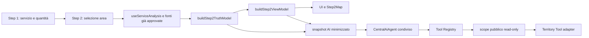

# Phase 4 — Territory AI read-only nello Step 2

## Audit iniziale

Lo Step 2 reale è la funzione `Step2` in `volantinipro-final.jsx`. Il configuratore mantiene lo stato condiviso nell'oggetto React `data` di `App`; Step 1 valorizza servizio e quantità, Step 2 mantiene le selezioni territoriali locali e, al proseguimento, proietta il risultato canonico nello stato condiviso per Step 3.

Flusso verificato:

`buildStep2TruthModel` è la fonte canonica condivisa con report e payload Step 3. `buildStep2ViewModel` aggiunge label e stati visuali senza sostituire il Truth Model. Il Territory Tool non chiama `useServiceAnalysis`, non interroga API, non usa la mappa e non esegue formule territoriali.

## Dati reali utilizzati

- servizio corrente e quantità inserita/corrente;
- territorio, modalità di selezione, raggio già selezionato e nomi delle aree;
- fabbisogno, shortage, surplus e allocazione già presenti nel Truth Model;
- stato di calcolo e disponibilità dichiarata;
- fonti e limitazioni prodotte dal registro canonico dello Step 2;
- KPI del ramo di servizio attivo.

Stati supportati: `available`, `partial`, `unavailable`, `loading`, `error`, `access_denied` tramite registry e `unsupported_service`.

### Differenze fra servizi

- **Door to Door:** famiglie, popolazione, copertura residenziale e fabbisogno, solo quando presenti nel ramo `d2d`.
- **Hand to Hand:** POI, punti selezionati, fermate/stazioni e rapporto operativo quantità-fabbisogno. Famiglie e copertura residenziale sono esplicitamente non applicabili. POI non equivalgono a flussi pedonali misurati.
- **Business:** attività disponibili/selezionate e piano materiali già prodotto. Le attività da POI non sono presentate come censimento ATECO completo; non vengono applicate metriche D2D.

## Placeholder e payload esclusi

Non vengono utilizzati `GEO_DATA`, `ZONE_DATA`, layer dimostrativi o valori hardcoded come evidenza AI. Sono inoltre esclusi:

- `rawData` del Truth Model;
- GeoJSON, geometrie, confini e coordinate;
- payload GIS/API e query tecniche;
- token, stack trace ed errori raw;
- oggetti React mutabili e dati personali;
- nomi contenenti marcatori test/demo/placeholder/fake/sample.

Lo snapshot conserva `null` come assenza; uno zero esplicitamente restituito resta zero.

## Snapshot e invalidazione

`buildTerritorialAiSnapshot` produce un oggetto ricorsivamente congelato con:

- `fingerprint`, versione schema e stato;
- servizio;
- territorio minimizzato e nomi selezionati;
- quantità già calcolate;
- KPI specifici del servizio;
- stato calcolo, campi mancanti, fonti e limitazioni.

Il fingerprint dipende soltanto da servizio, territorio, quantità, KPI, stato e fonti collegate. Cambio di servizio, comune/CAP/NIL, raggio, quantità o dati calcolati genera una nuova sessione effettiva. La precedente viene rimossa dal `AiStateManager` e la UI segnala che le risposte obsolete sono state invalidate. Logout/unmount rimuove solo le sessioni `vp_ai_territory_session:*`; le memorie Cliente e Admin restano separate.

## Grounding e operazioni consentite

Domande supportate, se il dato esiste:

- spiegazione generale o semplificata;
- sufficienza della quantità, shortage, surplus e fabbisogno;
- copertura D2D;
- famiglie D2D;
- aree selezionate;
- dati mancanti e motivi di parzialità.

Richieste di modifica quantità/raggio/zone, selezioni, salvataggio o avanzamento vengono rifiutate prima di chiamare il tool. Valori imposti nel messaggio non possono sostituire lo snapshot. Prezzi, previsioni di distribuzione, flussi pedonali certi, censimenti Business completi e metriche residenziali per H2H/B2B non sono supportati.

Ogni risposta fattuale cita `Analisi territoriale` e riporta le fonti leggibili collegate nello snapshot. Il runtime è deterministico e non effettua chiamate OpenAI.

## Feature flag e UI

`VITE_AI_TERRITORIAL_STEP2_ENABLED=false` è separata e disattivata per default. Il pannello è un dynamic import: con flag false non viene montato, non registra sessioni e il chunk `TerritorialAiAssistantPanel` non viene richiesto. Il builder dello snapshot non viene eseguito.

Il pannello è posizionato dopo il layout mappa/risultati, senza overlay e senza modificare dimensioni, zoom, tooltip, NIL o controlli geografici.

## File Phase 4

Nuovi moduli:

- `src/lib/step2/buildTerritorialAiSnapshot.js`
- `src/ai-foundation/integrations/territorial-step2/territoryToolAdapter.js`
- `src/ai-foundation/integrations/territorial-step2/TerritorialStep2ReadOnlyRuntime.js`
- `src/ai-foundation/integrations/territorial-step2/territorialStep2Foundation.js`
- `src/components/ai/territory/TerritorialAiAssistantPanel.jsx`
- `src/components/ai/territory/territorial-ai-assistant.css`
- test `ai_territorial_*` e screenshot `e2e-artifacts-ai-territorial-phase4/*`.

Modifiche circoscritte:

- `volantinipro-final.jsx`: proiezione dello snapshot e mount lazy dopo la mappa;
- `runtimeFlags.js` e `.env.example`: feature flag;
- `applicationAiFoundation.js`: selezione runtime contestuale per pagina sullo stesso singleton.

Non sono state modificate formule, motore territoriale, dati ISTAT/NIL, GIS, geocoding, geometrie, prezzi, API, database, RLS, routing o componenti mappa.

## Stabilizzazione P0/P1

Questa sezione sostituisce la precedente descrizione di snapshot, invalidazione e fonti.

- Il `TerritorialSnapshotProvider` e session-scoped e non possiede fallback globale.
- `update`, `read` e `clear` richiedono il `sessionId` trusted propagato da `CentralAiAgent` attraverso il Tool Registry, mai dagli argomenti del messaggio.
- La session key combina principal, pagina, campagna/preventivo quando disponibili, context ID applicativo e fingerprint territoriale. Gli identificativi vengono sanitizzati e sottoposti a hash.
- Unmount cancella soltanto la propria sessione. Logout o cambio account cancellano soltanto le sessioni del principal precedente.
- Il pannello e presentational: non importa Supabase, non interroga `auth.getUser` o `profiles` e riceve identity/context dal composition root.
- Lo snapshot contiene `fieldSources` immutabili per servizio, territorio, quantita, famiglie, popolazione, copertura, fabbisogno, surplus, POI, trasporto, attivita, materiali e stato del calcolo.
- Il runtime seleziona fonti per intent e distingue fonte interna Step 2, dato territoriale e limitazione. In assenza di provenienza specifica non usa una fonte casuale.
- I test includono concorrenza Varedo/Milano, due principal, due preventivi, logout live, cambio ruolo/account e unmount isolato.
